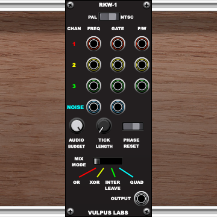

+++
date = '2025-12-31T16:39:06Z'
draft = false
title = 'Spectral Synthesis (1)'
+++
The original [Sinclair ZX Spectrum](https://en.wikipedia.org/wiki/ZX_Spectrum) had strikingly limited sound-generation capabilities: a single piezo beeper, whose value could be set to "on" or "off", was responsible for every kind of noise the computer could make, from bleeps and blips to its distinctive tape loading signal. There was no dedicated sound chip: all control over the bleeper had to come from the central CPU, which meant that it had to be interleaved with whatever else that CPU might be doing, like executing game logic or updating the display. This gave rise to some formidable programming challenges which, in the usual way of Spectrum game development, in turn gave rise to formidable ingenuity.

The Vulpus Labs [RKW-1](https://store.cherryaudio.com/modules/rkw-1) and [RKW-2](https://store.cherryaudio.com/modules/rkw-2) modules for [Voltage Modular](https://cherryaudio.com/products/voltage-modular) are emulations of two approaches to polyphonic sound generation on the Spectrum. They're not precise recreations (in the sense of emulating a Z80 processor and implementing a sound engine in Z80 machine code), but they reprise some of the characteristic strategies and limitations of Spectrum sound engines. In this post, I'm going to talk about the theory behind, and implementation of, the RKW-1; in the next, I'll tackle the RKW-2.

Let's start with the basics. To generate a single consistent tone using the beeper, a fast machine code loop might do the following:

1. Set the beeper to "on".
2. Loop (or do something else) for _n_ time units, leaving the beeper on.
3. Set the beeper to "off".
4. Loop for _m_ time units, leaving the beeper off.
5. Return to _1_.

This will produce a square wave, whose frequency is controlled by the total length of the loop between _1_ and _5_, and whose pulse width is controlled by the ratio between the length of the wait _n_ at _2_ and the length of the wait _m_ at _4_.

```plaintext
    ON ┌────────┐        ┌────────┐        ┌────────
       │   n    │   m    │   n    │   m    │   n
   OFF ┘        └────────┘        └────────┘
       
       ├── one cycle ────┤
       
       frequency = 1 / (n + m)
       pulse width = n / (n + m)
```

Changing the duty cycle of the wave changes its timbre and perceived volume:

```plaintext
    50% duty cycle (n = m):
    
    ON ┌────┐    ┌────┐    ┌────┐    ┌────┐
   OFF ┘    └────┘    └────┘    └────┘    └────
    
    25% duty cycle (n < m):
    
    ON ┌──┐      ┌──┐      ┌──┐      ┌──┐
   OFF ┘  └──────┘  └──────┘  └──────┘  └──────
```

A slightly more sophisticated approach is to store a _phase accumulator_ in a 16-bit register pair, and run a loop of fixed length that does the following:

1. Add a _phase delta_ value, representing the frequency, to the phase accumulator. If the value of the phase accumulator exceeds `0xFFFF`, it will loop back round to `0x0000`.
2. If the value of the phase accumulator is greater than the _pulse width threshold_, set the beeper to "on". Otherwise set it to "off". (For a 50% duty cycle, just set the beeper based on the high bit of the high byte of the accumulator)
3. Loop immediately to _1_.

```plaintext
    phase accumulator (16-bit)
    
    0xFFFF ┌─────────────────────────────────────────────────┐
           │     ╱│    ╱│    ╱│    ╱│    ╱│    ╱│    ╱│      │
           │    ╱ │   ╱ │   ╱ │   ╱ │   ╱ │   ╱ │   ╱ │      │
    thresh ┼───╱──│──╱──│──╱──│──╱──│──╱──│──╱──│──╱──│──────│
           │  ╱   │ ╱   │ ╱   │ ╱   │ ╱   │ ╱   │ ╱   │      │
           │ ╱    │╱    │╱    │╱    │╱    │╱    │╱    │      │
    0x0000 └─────────────────────────────────────────────────┘
                                  time →
    
    beeper output (threshold at 50%)
    
        ON     ┌──┐  ┌──┐  ┌──┐  ┌──┐  ┌──┐  ┌──┐  ┌──┐
       OFF  ───┘  └──┘  └──┘  └──┘  └──┘  └──┘  └──┘  └──
```

The value of the _phase delta_ will depend on the duration of the loop. The Spectrum's internal clock runs at 3.5MHz, and each Z80 instruction consumes a certain number of _T-states_, which are periods of that clock, so if you know exactly which instructions are going to be run within the loop and the T-state cost of each, you can measure the time (in nanoseconds!) it takes to complete one cycle of the loop. It's then just a matter of setting the phase delta so that the accumulator will wrap at the desired frequency, removing the need to introduce carefully-timed delay loops into the sound engine.

For instance, if your loop takes 80 T-states, it runs approximately 43,750 times per second. To generate a 440Hz tone (concert A), you'd need the accumulator to wrap 440 times per second, which means completing one full cycle every ~99.4 loop iterations —- so your phase delta would be roughly 65536 ÷ 99.4 ≈ 659. It's important to note here that we're fully in the realm of integer or fixed-point arithmetic -- everything is quite starkly numerically quantised! This contributes to a characteristic slight "out-of-tuneness" of Spectrum music, compared to equal temperament.

We now have the basis for a simple monophonic square wave oscillator, with variable frequency and pulse width, but what about polyphony? Here's where things get interesting. We still have just one beeper state to control, but if we have multiple on/off values from different oscillators we have to combine them in some way. We can OR them together (the beeper is `on` if any oscillator's state is `on`), XOR them together (the beeper is `on` if an odd number of oscillators are `on`, and `off` otherwise), or interleave them, giving each oscillator a time slice in which it controls the beeper state. In the interleaved approach, especially familiar from Spectrum game music, a single voice cycles rapidly between different pitches, tricking the ear into hearing multiple voices chirping simultaneously:



(It turns out that this doesn't fully exhaust the musically interesting options, but we'll get to that in the next post...)

Before we get into the Voltage Modular implementations, a word about interrupts. The Spectrum's Z80 processor received an interrupt signal synced to the TV display refresh rate (50Hz in the PAL region, 60Hz for NTSC), which caused the processor to stop whatever it was doing and run some special code called an interrupt handler, before returning to normal execution. Many game engines took advantage of this by implementing custom interrupt handlers that would generate chunks of sound at the refresh interval. This is why the sound in many Spectrum games has a low buzz to it -- that's the 50Hz cycle chopping into audio generation. It also accounts for some other interesting artefacts, such as an audible "stepping" in portamento pitch glides caused by the pitch (and hence the phase delta value) only being updated at the start of the interrupt handler. When polyphony is implemented through interleaving, it's often the refresh interrupt that triggers the switch between voices.

The Voltage Modular module I'm discussing in this post, RKW-1, emulates this approach, which is why it has a PAL/NTSC switch at the top of the control panel.



It's a fairly high-level, abstracted emulation: we're not actually running Z80 machine instructions, updating register values and so on. Instead, we divide the time between refresh interrupts into "ticks", with each tick representing a number of CPU cycles used to determine what the next state of the beeper should be. At each refresh the behaviour of each of the engine's four oscillators is updated, and at each tick each oscillator's phase accumulator runs forward by its phase delta and compared with the pulse width-controlling threshold to obtain the oscillator's binary `on`/`off` state. The oscillators' states are then combined to determine the beeper state at the end of that tick.

How do we sync this up with Voltage Modular's fixed 48kHz sample rate? In short, we cheat...

> UPDATE: not any more we don't. See [Spectral Synthesis (2)](/posts/spectral_synthesis_2). TLDR: the approach described below introduces aliasing, and while we want to keep things authentically nasty we don't want to mix that up with synthetic nastiness.

At each sample at the 48kHz rate we determine how long it's been since the last refresh, how many ticks have elapsed in that time, and therefore what the position of each oscillator's phase accumulator should be at the end of the last tick. In this way, we get automatic conversion from the (slightly abstracted and idealised) behaviour of a CPU running machine code instructions at 3.5MHz into Voltage Modular's sample rate, without having to simulate what happens "between" samples. All we care about is what the beeper's state would be "now", for each of a succession of precisely-clocked instants.

This is the core of it:

```java
public double processSample() {
    syncAccumulator += SAMPLE_LENGTH_MS;

    if (syncAccumulator > syncLengthMs) {
        syncAccumulator -= syncLengthMs;
        initialiseSync();
    }

    int currentTick = Math.min(
            budgetedTicksPerSync,
            (int) (syncAccumulator * tickLengthMsReciprocal));

    if (currentTick != previousTick) {
        output = outputAtTick(currentTick);
        previousTick = currentTick;
    }

    // Apply three-stage filter chain: HPF -> Peak -> LPF
    return filter.applyAsDouble(output);
}
```

The `syncAccumulator` is tracking the time in milliseconds since the last refresh signal, updating by the duration of one sample at 48kHz each time. Whenever it runs past `syncLengthMs` (either `SYNC_LENGTH_PAL = 1000.0 / 50.0` or `SYNC_LENGTH_NTSC = 1000.0 / 60.0`) it wraps around and we run `initialiseSync` to update the oscillator states for this refresh cycle.

We then determine the `currentTick`, capping it at a maximum `budgetedTicksPerSync`, by dividing the time since the last refresh signal by the tick length in milliseconds. (Anywhere you see a multiplication by `thingReciprocal` in Vulpus Labs code, it's a division by `thing` rewritten as a multiplication by a pre-calculated `1.0 / thing` for the sake of efficiency). If we're on a new tick, we call `outputAtTick` to determine what the beeper state should be at that tick. Then we pass the result into a filter chain which very loosely approximates the physical behaviour of a piezo beeper or television loudspeaker.

The function `outputAtTick` runs four oscillators, then calls `mixVoices` to combine their states into a single beeper state:

```java
private double outputAtTick(int currentTick) {
    // Regular tone channels (0-2)
    for (int i = 0; i < 3; i++) {
        int currentPhase = (startPhase[i] + (currentTick * rates[i])) & 0xFFFF;
        toggle[i] = playing[i] & (currentPhase > currentPulseWidth[i]);
        phase[i] = currentPhase;
    }

    // Noise channel (3)
    int currentPhase = (startPhase[3] + (currentTick * rates[3])) & 0xFFFF;
    phase[3] = currentPhase;

    // Clock the LFSR when phase wraps (changes from high to low)
    if (playing[3] && currentPhase < noisePhase) {
        noiseLFSR.clock();
    }
    noisePhase = currentPhase;
    toggle[3] = playing[3] & noiseLFSR.getOutput();

    return mixVoices();
}
```

As you can see, each oscillator's `currentPhase` is calculated based on the phase it had at the start of the refresh cycle, `startPhase[i]`, plus the value of `currentTick` multiplied by its phase delta (`rates[i]`). The current phase is recorded in `phase[i]` so that it can be used to initialise `startPhase[i]` at the start of the next refresh cycle. The "noise" channel pulls a boolean from an LFSR (Linear Feedback Shift Register) pseudo-random number generator every time its phase wraps, for authentically crunchy noise sounds.

Finally, `mixVoices` applies one of four mixing strategies, including one, `QUAD`, which pretends that we have four Spectrums each producing a separate beeper tone and simply sums them:

```java
private double mixVoices() {
    return switch (mixMode) {
        case XOR -> {
            boolean beeperState = false;
            for (int i=0; i<4; i++) {
                beeperState = beeperState ^ toggle[i];
            }
            yield beeperState ? 5.0 : 0.0;
        }
        case OR -> {
            boolean beeperState = false;
            for (int i=0; i<4; i++) {
                beeperState = beeperState | toggle[i];
            }
            yield beeperState ? 5.0 : 0.0;
        }
        case QUAD -> {
            double sum = 0.0;
            for (int i = 0; i < 4; i++) {
                sum += toggle[i] ? 1.25 : 0.0;
            }
            yield sum;
        }
        case INTERLEAVE -> toggle[interleaveSelector] ? 5.0 : 0.0;
    };
}
```

(`interleaveSelector` is updated each time the refresh signal fires, producing the cycling-between-voices effect when in `INTERLEAVE` mode).

Here's what each mode sounds like, starting with QUAD, then INTERLEAVE, then XOR, then finally OR:



A little like [Prismatic](`/posts/prismatic`), the purpose of `RKW-1` is to generate sounds that are _degraded_ in characterful ways related to numerical and temporal quantisation, foregrounding the limitations of historical hardware. The constraints of the emulated Spectrum sound engine produce quite _extreme_ degradation -- but we can go more extreme. In the next post I'll talk about the RKW-2, which aims to emulate a sound its original creator once described as "like a vacuum cleaner with nails stuck in it"...
